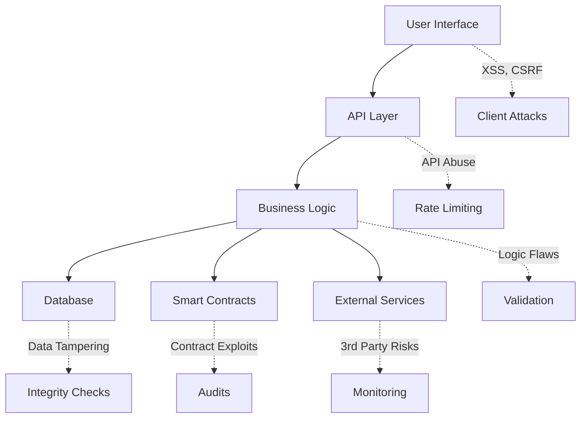

# [SECURITY] Reputation System Security Model

**Version**: 1.0.0  
**Last Updated**: January 2025  
**Classification**: CRITICAL - SECURITY SENSITIVE

## Table of Contents

1. [Executive Summary](#executive-summary)
2. [Threat Model](#threat-model)
3. [Attack Vectors & Countermeasures](#attack-vectors--countermeasures)
4. [Security Architecture](#security-architecture)
5. [Anti-Manipulation Mechanisms](#anti-manipulation-mechanisms)
6. [Smart Contract Security](#smart-contract-security)
7. [Data Integrity & Tamper-Proofing](#data-integrity--tamper-proofing)
8. [Privacy & Compliance](#privacy--compliance)
9. [Implementation Guidelines](#implementation-guidelines)
10. [Monitoring & Detection](#monitoring--detection)
11. [Incident Response](#incident-response)
12. [Testing & Validation](#testing--validation)

---

## Executive Summary

The ClearHold Reputation System is a critical trust infrastructure component that requires robust security measures to prevent manipulation, ensure integrity, and maintain user privacy. This document outlines the comprehensive security model designed to protect against various attack vectors while enabling legitimate reputation building.

### Key Security Objectives

1. **Integrity**: Ensure reputation scores accurately reflect user behavior
2. **Non-repudiation**: Create immutable audit trails for all reputation events
3. **Resilience**: Resist manipulation attempts and gaming strategies
4. **Privacy**: Protect user data while maintaining transparency
5. **Availability**: Ensure system remains operational under attack

---

## Threat Model

### Primary Threat Actors

1. **Malicious Users**
   - Motivation: Inflate own reputation or damage competitors
   - Capabilities: Multiple accounts, automated tools, collusion
   - Risk Level: HIGH

2. **Organized Fraud Rings**
   - Motivation: Financial gain through reputation manipulation
   - Capabilities: Sophisticated attacks, resource pooling, persistence
   - Risk Level: CRITICAL

3. **Competitors**
   - Motivation: Damage platform reputation or steal users
   - Capabilities: DDoS, targeted attacks, social engineering
   - Risk Level: MEDIUM

4. **Insider Threats**
   - Motivation: Financial gain or revenge
   - Capabilities: System access, knowledge of countermeasures
   - Risk Level: HIGH

### Attack Surface Analysis



---

## Attack Vectors & Countermeasures

### 1. Sybil Attacks

**Attack Description**: Creating multiple fake identities to manipulate reputation scores.

**Countermeasures**:

```typescript
interface SybilDefense {
  // Identity Verification Requirements
  identityVerification: {
    kycRequired: true,
    documentVerification: 'government_issued',
    livenessCheck: true,
    uniquenessValidation: ['face_recognition', 'document_hash']
  },
  
  // Behavioral Analysis
  behaviorAnalysis: {
    ipTracking: true,
    deviceFingerprinting: true,
    behavioralBiometrics: true,
    transactionPatternAnalysis: true
  },
  
  // Economic Barriers
  economicBarriers: {
    minimumStake: '1000 USDC',
    stakeLockPeriod: '30 days',
    reputationBond: true,
    slashingConditions: ['sybil_detected', 'fraud_confirmed']
  }
}
```

**Implementation**:

```typescript
class SybilDetectionService {
  async detectSybilPatterns(userId: string): Promise<SybilRiskScore> {
    const factors = await Promise.all([
      this.checkIPClustering(userId),
      this.analyzeDeviceFingerprints(userId),
      this.detectTimingPatterns(userId),
      this.checkTransactionGraph(userId),
      this.analyzeBehavioralBiometrics(userId)
    ]);
    
    return this.calculateRiskScore(factors);
  }
  
  private async checkIPClustering(userId: string): Promise<number> {
    // Detect multiple accounts from same IP/subnet
    const userIPs = await this.getUserIPHistory(userId);
    const relatedAccounts = await this.findAccountsBySimilarIPs(userIPs);
    
    // Calculate suspicion score based on clustering
    return this.calculateIPClusteringScore(relatedAccounts);
  }
}
```

### 2. Collusion Attacks

**Attack Description**: Multiple real users coordinating to manipulate reputation.

**Countermeasures**:

```typescript
interface CollusionDetection {
  // Graph Analysis
  graphAnalysis: {
    communityDetection: 'louvain_algorithm',
    centralityMeasures: ['betweenness', 'eigenvector'],
    anomalyThreshold: 0.85
  },
  
  // Pattern Recognition
  patterns: {
    reciprocalTransactions: { maxPercentage: 0.2, timeWindow: '30d' },
    circularTrading: { maxChainLength: 3, penalty: 0.5 },
    timingCorrelation: { threshold: 0.7, action: 'flag_review' }
  },
  
  // Penalties
  penalties: {
    firstOffense: { reputationReduction: 0.2, duration: '90d' },
    repeatOffense: { reputationReduction: 0.5, suspension: true },
    networkPenalty: { applyToAllParticipants: true }
  }
}
```

### 3. Reputation Farming

**Attack Description**: Automated or manual gaming of the system through repetitive actions.

**Countermeasures**:

```typescript
class ReputationFarmingDefense {
  // Diminishing returns algorithm
  calculateReputationGain(action: ReputationAction): number {
    const recentActions = this.getRecentActions(action.userId, action.type);
    const timeFactor = this.calculateTimeFactor(recentActions);
    const diversityFactor = this.calculateDiversityFactor(action.userId);
    const volumeFactor = this.calculateVolumeFactor(action.amount);
    
    // Apply exponential decay for repeated actions
    const baseGain = action.basePoints;
    const adjustedGain = baseGain * timeFactor * diversityFactor * volumeFactor;
    
    // Minimum threshold to prevent gaming
    return Math.max(adjustedGain, action.minimumPoints);
  }
  
  private calculateTimeFactor(recentActions: Action[]): number {
    // Exponential decay based on frequency
    const hoursSinceLastAction = this.getHoursSinceLastAction(recentActions);
    return Math.min(1, hoursSinceLastAction / 24);
  }
}
```

### 4. False Dispute Attacks

**Attack Description**: Filing false disputes to damage others' reputation.

**Countermeasures**:

```typescript
interface DisputeSecurityModel {
  // Stake Requirements
  disputeStaking: {
    minimumStake: (transactionValue: number) => transactionValue * 0.1,
    stakeLockPeriod: '14 days',
    slashingRules: {
      falseDispute: { percentage: 1.0, redistributeTo: 'defendant' },
      frivolousDispute: { percentage: 0.5, redistributeTo: 'treasury' },
      validDispute: { percentage: 0, returnStake: true }
    }
  },
  
  // Evidence Requirements
  evidenceValidation: {
    requiredTypes: ['transaction_hash', 'communication_logs', 'documents'],
    verificationMethods: ['cryptographic_proof', 'third_party_verification'],
    tamperDetection: true
  },
  
  // Reputation Impact
  reputationImpact: {
    duringDispute: { freeze: true, displayWarning: true },
    falseAccuser: { penalty: -20, publicRecord: true },
    validDispute: { accuser: +5, defendant: -10 }
  }
}
```

### 5. Data Injection Attacks

**Attack Description**: Attempting to inject malicious data into reputation calculations.

**Countermeasures**:

```typescript
class DataValidationService {
  validateReputationInput(input: any): ValidationResult {
    // Input sanitization
    const sanitized = this.sanitizeInput(input);
    
    // Schema validation
    const schemaValidation = this.validateSchema(sanitized, ReputationEventSchema);
    if (!schemaValidation.valid) {
      return { valid: false, error: 'Schema validation failed' };
    }
    
    // Business logic validation
    const businessValidation = this.validateBusinessRules(sanitized);
    if (!businessValidation.valid) {
      return { valid: false, error: businessValidation.error };
    }
    
    // Cryptographic validation
    const cryptoValidation = this.validateCryptographicProof(sanitized);
    if (!cryptoValidation.valid) {
      return { valid: false, error: 'Invalid cryptographic proof' };
    }
    
    return { valid: true, data: sanitized };
  }
}
```

---

## Security Architecture

### Layered Defense Model

```typescript
interface ReputationSecurityArchitecture {
  // Layer 1: Perimeter Defense
  perimeter: {
    waf: 'CloudFlare Enterprise',
    ddosProtection: true,
    rateLimiting: {
      global: '1000/hour',
      perUser: '100/hour',
      perAction: '10/minute'
    }
  },
  
  // Layer 2: Application Security
  application: {
    authentication: 'JWT + MFA',
    authorization: 'RBAC + ABAC',
    encryption: {
      atRest: 'AES-256-GCM',
      inTransit: 'TLS 1.3',
      keys: 'AWS KMS rotation'
    }
  },
  
  // Layer 3: Data Security
  data: {
    integrity: 'HMAC-SHA256',
    audit: 'Immutable event log',
    backup: 'Cross-region replication',
    privacy: 'Differential privacy'
  },
  
  // Layer 4: Smart Contract Security
  blockchain: {
    multisig: '3 of 5',
    timelock: '48 hours',
    pausable: true,
    upgradeable: 'Proxy pattern'
  }
}
```

### Zero Trust Implementation

```typescript
class ZeroTrustReputationService {
  async processReputationEvent(event: ReputationEvent): Promise<void> {
    // 1. Verify identity at every step
    const identity = await this.verifyIdentity(event.userId);
    if (!identity.verified) throw new UnauthorizedError();
    
    // 2. Validate permissions for specific action
    const permissions = await this.checkPermissions(identity, event.action);
    if (!permissions.allowed) throw new ForbiddenError();
    
    // 3. Verify data integrity
    const integrity = await this.verifyIntegrity(event);
    if (!integrity.valid) throw new IntegrityError();
    
    // 4. Check rate limits
    const rateLimit = await this.checkRateLimit(identity, event.action);
    if (rateLimit.exceeded) throw new RateLimitError();
    
    // 5. Log everything
    await this.auditLog(identity, event, 'processing');
    
    // 6. Process with continuous verification
    await this.processWithVerification(event, identity);
  }
}
```

---

## Anti-Manipulation Mechanisms

### 1. Reputation Decay Algorithm

```typescript
class ReputationDecayService {
  calculateDecayedScore(user: User): number {
    const events = this.getReputationEvents(user.id);
    let totalScore = 0;
    
    for (const event of events) {
      const age = Date.now() - event.timestamp;
      const decayFactor = this.calculateDecayFactor(age, event.type);
      const weightedScore = event.points * decayFactor;
      totalScore += weightedScore;
    }
    
    return Math.max(0, Math.min(100, totalScore));
  }
  
  private calculateDecayFactor(ageMs: number, eventType: string): number {
    const days = ageMs / (1000 * 60 * 60 * 24);
    
    // Different decay rates for different event types
    const decayRates = {
      transaction_complete: 0.001,  // Slow decay
      dispute_resolved: 0.005,      // Medium decay
      review_received: 0.01,        // Fast decay
      verification_complete: 0      // No decay
    };
    
    const rate = decayRates[eventType] || 0.005;
    return Math.exp(-rate * days);
  }
}
```

### 2. Anomaly Detection System

```typescript
class AnomalyDetectionService {
  async detectAnomalies(userId: string): Promise<AnomalyReport> {
    const features = await this.extractFeatures(userId);
    const model = await this.loadModel('reputation_anomaly_v2');
    
    const anomalyScore = model.predict(features);
    
    if (anomalyScore > 0.8) {
      await this.triggerManualReview(userId, anomalyScore, features);
      await this.freezeReputation(userId);
    }
    
    return {
      userId,
      score: anomalyScore,
      features,
      actions: anomalyScore > 0.8 ? ['frozen', 'under_review'] : []
    };
  }
  
  private async extractFeatures(userId: string): Promise<Features> {
    return {
      transactionVelocity: await this.getTransactionVelocity(userId),
      reputationGrowthRate: await this.getReputationGrowthRate(userId),
      networkCentrality: await this.getNetworkCentrality(userId),
      behavioralConsistency: await this.getBehavioralConsistency(userId),
      timingPatterns: await this.getTimingPatterns(userId)
    };
  }
}
```

### 3. Proof of Stake Integration

```typescript
interface StakeBasedReputation {
  // Stake requirements by reputation level
  stakeRequirements: {
    bronze: { minimum: '100 USDC', lockPeriod: '7 days' },
    silver: { minimum: '500 USDC', lockPeriod: '14 days' },
    gold: { minimum: '2000 USDC', lockPeriod: '30 days' },
    platinum: { minimum: '10000 USDC', lockPeriod: '90 days' }
  },
  
  // Slashing conditions
  slashingRules: [
    { condition: 'false_information', penalty: 0.5 },
    { condition: 'manipulation_attempt', penalty: 1.0 },
    { condition: 'terms_violation', penalty: 0.3 },
    { condition: 'dispute_loss', penalty: 0.1 }
  ],
  
  // Stake rewards
  rewards: {
    validationParticipation: '0.1% daily',
    disputeResolution: '2% of dispute value',
    communityService: '50 REP tokens/month'
  }
}
```

---

## Smart Contract Security

### 1. Reputation Contract Architecture

```solidity
// SPDX-License-Identifier: MIT
pragma solidity ^0.8.19;

import "@openzeppelin/contracts-upgradeable/access/AccessControlUpgradeable.sol";
import "@openzeppelin/contracts-upgradeable/security/PausableUpgradeable.sol";
import "@openzeppelin/contracts-upgradeable/security/ReentrancyGuardUpgradeable.sol";

contract ReputationSystemV1 is 
    AccessControlUpgradeable, 
    PausableUpgradeable, 
    ReentrancyGuardUpgradeable 
{
    // Roles
    bytes32 public constant UPDATER_ROLE = keccak256("UPDATER_ROLE");
    bytes32 public constant VALIDATOR_ROLE = keccak256("VALIDATOR_ROLE");
    
    // Reputation event structure
    struct ReputationEvent {
        uint256 timestamp;
        address subject;
        int256 scoreChange;
        string eventType;
        bytes32 evidenceHash;
        bool validated;
    }
    
    // Security features
    mapping(address => uint256) public nonces;
    mapping(bytes32 => bool) public processedEvents;
    uint256 public constant MAX_SCORE_CHANGE = 20;
    uint256 public constant MIN_EVENT_INTERVAL = 1 hours;
    
    // Events
    event ReputationUpdated(
        address indexed user,
        int256 scoreChange,
        string eventType,
        bytes32 evidenceHash
    );
    
    // Modifiers
    modifier validScoreChange(int256 change) {
        require(
            change >= -int256(MAX_SCORE_CHANGE) && 
            change <= int256(MAX_SCORE_CHANGE),
            "Score change exceeds limits"
        );
        _;
    }
    
    modifier nonReplayable(bytes32 eventId) {
        require(!processedEvents[eventId], "Event already processed");
        processedEvents[eventId] = true;
        _;
    }
}
```

### 2. Cryptographic Proof System

```typescript
class ReputationProofService {
  generateReputationProof(event: ReputationEvent): ReputationProof {
    // Create Merkle tree of all reputation events
    const leaves = this.getAllEventHashes(event.userId);
    const tree = new MerkleTree(leaves, keccak256);
    
    // Generate proof for specific event
    const eventHash = this.hashEvent(event);
    const proof = tree.getProof(eventHash);
    
    // Sign the proof
    const signature = this.signProof({
      root: tree.getRoot(),
      eventHash,
      proof,
      timestamp: Date.now()
    });
    
    return {
      merkleRoot: tree.getRoot(),
      eventHash,
      proof,
      signature,
      timestamp: Date.now()
    };
  }
  
  verifyReputationProof(proof: ReputationProof): boolean {
    // Verify signature
    if (!this.verifySignature(proof)) return false;
    
    // Verify Merkle proof
    const verified = MerkleTree.verify(
      proof.proof,
      proof.eventHash,
      proof.merkleRoot,
      keccak256
    );
    
    // Verify timestamp (prevent replay)
    const age = Date.now() - proof.timestamp;
    if (age > 3600000) return false; // 1 hour expiry
    
    return verified;
  }
}
```

### 3. Cross-Chain Reputation Bridge

```solidity
contract ReputationBridge {
    using ECDSA for bytes32;
    
    // Multi-signature validation
    address[] public validators;
    uint256 public requiredSignatures;
    
    // Chain-specific reputation roots
    mapping(uint256 => bytes32) public chainRoots;
    
    // Replay protection
    mapping(bytes32 => bool) public processedProofs;
    
    function submitCrossChainReputation(
        uint256 sourceChain,
        bytes32 reputationRoot,
        bytes[] calldata signatures
    ) external {
        require(signatures.length >= requiredSignatures, "Insufficient signatures");
        
        bytes32 message = keccak256(abi.encodePacked(
            sourceChain,
            reputationRoot,
            block.chainid,
            address(this)
        ));
        
        // Verify multi-sig
        address[] memory signers = new address[](signatures.length);
        for (uint i = 0; i < signatures.length; i++) {
            signers[i] = message.toEthSignedMessageHash().recover(signatures[i]);
            require(isValidator(signers[i]), "Invalid validator");
        }
        
        // Ensure unique signers
        require(hasUniqueSigners(signers), "Duplicate signatures");
        
        // Update reputation root
        chainRoots[sourceChain] = reputationRoot;
    }
}
```

---

## Data Integrity & Tamper-Proofing

### 1. Immutable Event Log

```typescript
class ImmutableReputationLog {
  private readonly eventStore: EventStore;
  private readonly ipfs: IPFSClient;
  
  async logReputationEvent(event: ReputationEvent): Promise<string> {
    // 1. Generate event hash
    const eventHash = this.generateEventHash(event);
    
    // 2. Create tamper-proof record
    const record = {
      ...event,
      hash: eventHash,
      previousHash: await this.getPreviousHash(event.userId),
      timestamp: Date.now(),
      signature: await this.signEvent(event)
    };
    
    // 3. Store in multiple locations
    const [dbId, ipfsHash, blockchainTx] = await Promise.all([
      this.eventStore.append(record),
      this.ipfs.add(JSON.stringify(record)),
      this.blockchain.logEvent(eventHash)
    ]);
    
    // 4. Create audit entry
    await this.createAuditEntry({
      eventHash,
      storageLocations: { dbId, ipfsHash, blockchainTx },
      timestamp: Date.now()
    });
    
    return eventHash;
  }
  
  async verifyEventIntegrity(eventId: string): Promise<boolean> {
    const event = await this.eventStore.get(eventId);
    
    // Verify hash chain
    const calculatedHash = this.generateEventHash(event);
    if (calculatedHash !== event.hash) return false;
    
    // Verify signature
    if (!await this.verifySignature(event)) return false;
    
    // Cross-reference with blockchain
    const blockchainHash = await this.blockchain.getEventHash(eventId);
    if (blockchainHash !== event.hash) return false;
    
    return true;
  }
}
```

### 2. Differential Privacy Implementation

```typescript
class DifferentialPrivacyService {
  // Add noise to protect individual privacy while maintaining utility
  addPrivacyNoise(score: number, epsilon: number = 1.0): number {
    const sensitivity = 10; // Max score change
    const scale = sensitivity / epsilon;
    
    // Laplace mechanism
    const noise = this.laplacian(0, scale);
    const noisyScore = score + noise;
    
    // Ensure score remains in valid range
    return Math.max(0, Math.min(100, noisyScore));
  }
  
  // Aggregate queries with privacy
  async getAggregateReputation(
    filter: UserFilter,
    epsilon: number = 1.0
  ): Promise<AggregateStats> {
    const users = await this.getUsersByFilter(filter);
    
    // Add noise to counts
    const actualCount = users.length;
    const noisyCount = actualCount + this.laplacian(0, 1/epsilon);
    
    // Calculate average with noise
    const actualAverage = users.reduce((sum, u) => sum + u.reputation, 0) / actualCount;
    const noisyAverage = this.addPrivacyNoise(actualAverage, epsilon);
    
    return {
      count: Math.max(0, Math.round(noisyCount)),
      average: noisyAverage,
      epsilon: epsilon
    };
  }
  
  private laplacian(mu: number, b: number): number {
    const u = Math.random() - 0.5;
    return mu - b * Math.sign(u) * Math.log(1 - 2 * Math.abs(u));
  }
}
```

---

## Privacy & Compliance

### 1. GDPR Compliance

```typescript
interface GDPRCompliantReputation {
  // Data minimization
  dataCollection: {
    purpose: 'reputation_calculation',
    legalBasis: 'legitimate_interest',
    retention: '2 years active + 1 year archive',
    fields: ['transaction_id', 'outcome', 'timestamp']
  },
  
  // User rights
  userRights: {
    access: true,
    rectification: 'with_evidence',
    erasure: 'with_restrictions',
    portability: true,
    objection: true
  },
  
  // Privacy by design
  privacyFeatures: {
    pseudonymization: true,
    encryption: true,
    minimization: true,
    accuracy: true
  }
}
```

### 2. Right to be Forgotten Implementation

```typescript
class ReputationPrivacyService {
  async handleDeletionRequest(userId: string): Promise<DeletionReport> {
    // Verify user identity
    await this.verifyUserIdentity(userId);
    
    // Check for legal obligations to retain
    const retentionObligations = await this.checkRetentionObligations(userId);
    if (retentionObligations.required) {
      return {
        status: 'partial',
        reason: retentionObligations.reason,
        retainedData: retentionObligations.categories
      };
    }
    
    // Anonymize historical data
    await this.anonymizeUserData(userId);
    
    // Remove PII but keep aggregated stats
    await this.removePII(userId);
    
    // Update blockchain with deletion proof
    await this.recordDeletionOnChain(userId);
    
    return {
      status: 'complete',
      timestamp: Date.now(),
      verificationHash: await this.generateDeletionProof(userId)
    };
  }
}
```

---

## Implementation Guidelines

### 1. Security-First Development

```typescript
// Security checklist for reputation features
const SECURITY_CHECKLIST = {
  preImplementation: [
    'Threat model the feature',
    'Review with security team',
    'Design security controls',
    'Plan security tests'
  ],
  
  implementation: [
    'Use secure coding practices',
    'Implement input validation',
    'Add rate limiting',
    'Include audit logging',
    'Handle errors securely'
  ],
  
  testing: [
    'Unit test security controls',
    'Integration test edge cases',
    'Penetration test the feature',
    'Test manipulation attempts',
    'Verify privacy compliance'
  ],
  
  deployment: [
    'Security review sign-off',
    'Enable monitoring alerts',
    'Document security features',
    'Train support team',
    'Plan incident response'
  ]
};
```

### 2. Secure API Design

```typescript
// Reputation API with built-in security
@Controller('reputation')
@UseGuards(AuthGuard, RateLimitGuard)
export class ReputationController {
  @Post('update')
  @RequirePermissions('reputation.update')
  @ValidateInput(ReputationUpdateSchema)
  @AuditLog('reputation.update')
  async updateReputation(
    @Body() update: ReputationUpdate,
    @User() user: AuthenticatedUser
  ): Promise<ReputationResponse> {
    // Validate request integrity
    await this.validateRequestIntegrity(update);
    
    // Check for manipulation attempts
    await this.antiManipulationCheck(user, update);
    
    // Process with security controls
    const result = await this.reputationService.secureUpdate(update, user);
    
    // Sanitize response
    return this.sanitizeResponse(result);
  }
}
```

---

## Monitoring & Detection

### 1. Real-time Monitoring Dashboard

```typescript
interface ReputationMonitoring {
  // Key metrics to track
  metrics: {
    manipulationAttempts: MetricConfig,
    anomalyScore: MetricConfig,
    systemHealth: MetricConfig,
    userComplaints: MetricConfig
  },
  
  // Alert thresholds
  alerts: {
    sybilDetection: { threshold: 5, window: '1h', severity: 'high' },
    collusionPattern: { threshold: 0.8, window: '24h', severity: 'critical' },
    anomalySpike: { threshold: 100, window: '5m', severity: 'medium' },
    systemError: { threshold: 10, window: '1m', severity: 'critical' }
  },
  
  // Automated responses
  responses: {
    freezeAccount: ['sybil_confirmed', 'manipulation_detected'],
    manualReview: ['high_anomaly_score', 'multiple_complaints'],
    rateLimit: ['suspicious_activity', 'api_abuse'],
    alertTeam: ['critical_severity', 'system_compromise']
  }
}
```

### 2. Machine Learning Detection Pipeline

```python
class ReputationAnomalyDetector:
    def __init__(self):
        self.models = {
            'isolation_forest': IsolationForest(contamination=0.1),
            'autoencoder': self.build_autoencoder(),
            'lstm': self.build_lstm_model()
        }
    
    def detect_anomalies(self, user_behavior: pd.DataFrame) -> AnomalyResults:
        # Feature engineering
        features = self.extract_features(user_behavior)
        
        # Ensemble prediction
        predictions = {}
        for name, model in self.models.items():
            predictions[name] = model.predict(features)
        
        # Combine predictions
        ensemble_score = self.ensemble_vote(predictions)
        
        # Generate explanations
        explanations = self.explain_anomalies(features, ensemble_score)
        
        return AnomalyResults(
            score=ensemble_score,
            explanations=explanations,
            recommended_actions=self.recommend_actions(ensemble_score)
        )
```

---

## Incident Response

### 1. Reputation Manipulation Incident Playbook

```yaml
incident_type: reputation_manipulation
severity_levels:
  - low: Single user affected, minimal impact
  - medium: Multiple users affected, contained impact
  - high: Systematic manipulation, significant impact
  - critical: Platform-wide manipulation, severe impact

response_steps:
  1_detection:
    - automated_alert: Monitor triggers alert
    - manual_report: User reports suspicious activity
    - routine_check: Discovered during audit
    
  2_assessment:
    - scope: Determine affected users and transactions
    - impact: Calculate reputation score deviations
    - method: Identify manipulation technique
    
  3_containment:
    - freeze_scores: Prevent further changes
    - isolate_accounts: Quarantine suspicious users
    - pause_features: Disable affected functionality
    
  4_investigation:
    - collect_evidence: Gather logs and proofs
    - analyze_patterns: Identify attack vectors
    - trace_source: Find originating accounts
    
  5_remediation:
    - restore_scores: Recalculate accurate reputations
    - apply_penalties: Punish confirmed manipulators
    - patch_vulnerability: Fix exploited weaknesses
    
  6_recovery:
    - notify_users: Inform affected parties
    - compensate_victims: Restore lost reputation
    - update_documentation: Record lessons learned
    
  7_post_incident:
    - security_review: Analyze root causes
    - update_controls: Strengthen defenses
    - training: Educate team on new threats
```

### 2. Automated Response System

```typescript
class AutomatedIncidentResponse {
  async handleReputationIncident(incident: ReputationIncident): Promise<void> {
    // Immediate automated actions
    const actions = this.determineActions(incident);
    
    for (const action of actions) {
      switch (action.type) {
        case 'FREEZE_REPUTATION':
          await this.freezeUserReputation(action.targets);
          break;
          
        case 'INVALIDATE_TRANSACTIONS':
          await this.invalidateTransactions(action.transactions);
          break;
          
        case 'TRIGGER_RECALCULATION':
          await this.recalculateReputation(action.users);
          break;
          
        case 'NOTIFY_AUTHORITIES':
          await this.notifyCompliance(incident);
          break;
      }
    }
    
    // Create incident report
    await this.createIncidentReport(incident, actions);
  }
}
```

---

## Testing & Validation

### 1. Security Test Suite

```typescript
describe('Reputation Security Tests', () => {
  describe('Sybil Attack Prevention', () => {
    it('should detect multiple accounts from same device', async () => {
      const device = generateDeviceFingerprint();
      
      // Create multiple accounts from same device
      const accounts = await Promise.all(
        Array(5).fill(0).map(() => createAccount({ device }))
      );
      
      // Attempt reputation manipulation
      const result = await attemptReputationBoost(accounts);
      
      expect(result.detected).toBe(true);
      expect(result.action).toBe('accounts_flagged');
    });
  });
  
  describe('Collusion Detection', () => {
    it('should identify circular trading patterns', async () => {
      const users = await createTestUsers(4);
      
      // Create circular transaction pattern
      await createTransaction(users[0], users[1], 1000);
      await createTransaction(users[1], users[2], 1000);
      await createTransaction(users[2], users[3], 1000);
      await createTransaction(users[3], users[0], 1000);
      
      const analysis = await analyzeTransactionGraph(users);
      
      expect(analysis.collusionDetected).toBe(true);
      expect(analysis.pattern).toBe('circular_trading');
    });
  });
});
```

### 2. Penetration Testing Scenarios

```typescript
const REPUTATION_PENTEST_SCENARIOS = [
  {
    name: 'Sybil Attack Simulation',
    description: 'Create 100 fake accounts and attempt reputation manipulation',
    steps: [
      'Generate unique device fingerprints',
      'Use residential proxies for IP diversity',
      'Implement human-like behavior patterns',
      'Attempt gradual reputation building',
      'Test detection thresholds'
    ]
  },
  {
    name: 'Time-based Manipulation',
    description: 'Exploit timing vulnerabilities in reputation calculation',
    steps: [
      'Analyze reputation update intervals',
      'Test race conditions',
      'Attempt double-spending reputation',
      'Exploit cache inconsistencies',
      'Test rollback scenarios'
    ]
  },
  {
    name: 'API Fuzzing',
    description: 'Test reputation API security',
    steps: [
      'Fuzz all input parameters',
      'Test boundary conditions',
      'Attempt injection attacks',
      'Test authentication bypass',
      'Verify rate limiting'
    ]
  }
];
```

### 3. Continuous Security Validation

```typescript
class ContinuousSecurityValidator {
  async runDailySecurityChecks(): Promise<SecurityReport> {
    const checks = [
      this.validateDataIntegrity(),
      this.checkForAnomalies(),
      this.testSecurityControls(),
      this.verifyPrivacyCompliance(),
      this.auditAccessLogs()
    ];
    
    const results = await Promise.all(checks);
    
    return {
      timestamp: Date.now(),
      passed: results.every(r => r.passed),
      details: results,
      recommendations: this.generateRecommendations(results)
    };
  }
}
```

---

## Appendix: Security Contacts

- **Security Team**: security@clearhold.app
- **Incident Response**: incident-response@clearhold.app
- **Bug Bounty**: security-bounty@clearhold.app
- **Compliance**: compliance@clearhold.app

**Document Classification**: CRITICAL - Handle with appropriate security measures